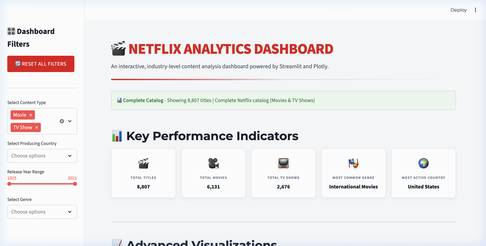
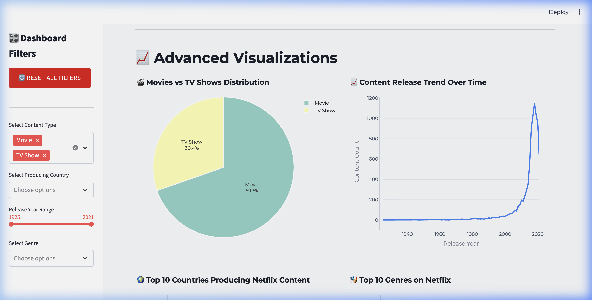
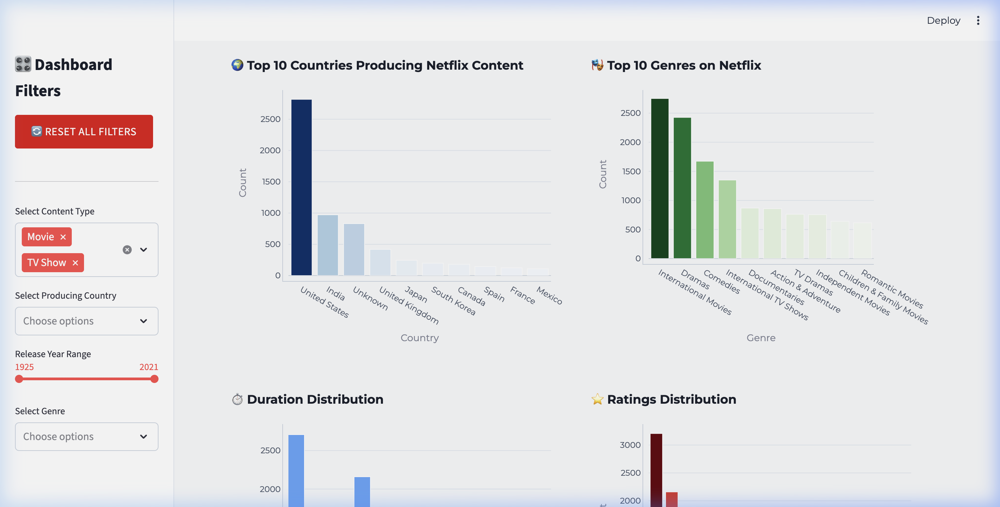
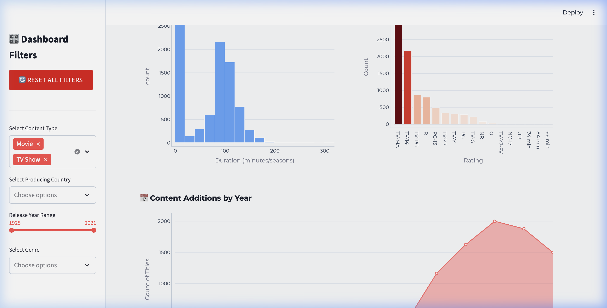
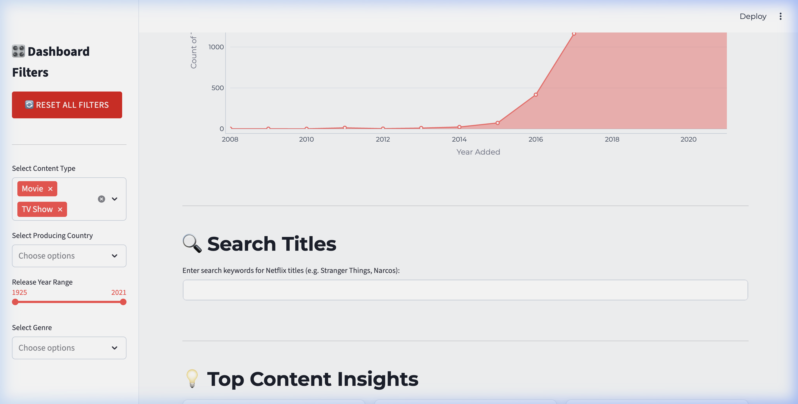
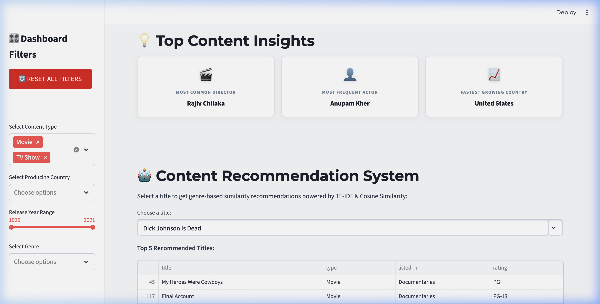

# 🎬 Netflix Data Analytics Dashboard

[](https://netflix-data-project-ezrwaog526uskrzb4zsud8.streamlit.app/)

An advanced, industry-level Streamlit web application designed with a dark Netflix brand aesthetic to clean, process, analyze, and recommend Netflix content.

🚀 **Live URL:** [https://netflix-data-project-ezrwaog526uskrzb4zsud8.streamlit.app/](https://netflix-data-project-ezrwaog526uskrzb4zsud8.streamlit.app/)

---

## 📸 Dashboard Screenshots

### 🏠 Home Screen & Key Performance Indicators


### 📈 Overview Charts & Content Release Trend


### 🌍 Top Countries Producing Content & Top Genres


### ⏱️ Content Duration & Ratings Distribution


### 🔍 Interactive Content Search


### 🤖 TF-IDF Content Recommendation Engine


---

## 🚀 Features

### 🎨 Netflix Branded UI/UX Overhaul
- **Montserrat Typography**: Sleek modern Google Font injection.
- **Glassmorphic Interactive Cards**: Glassmorphic KPI metrics dynamically scale on hover (micro-animations) with Netflix red accents, safe from text truncation.
- **Premium Light Theme**: Clean light backgrounds (`#f8f9fa` for app, `#ffffff` for sidebar) matching the original light theme color scheme.

### 📊 Clean & Interactive Data Processing
- Handles missing country, director, and cast data dynamically with `Unknown` fallbacks.
- Converts metadata fields and extracts custom numeric variables for duration analysis.
- Sidebar filters for content type, producing country, release year range, and specific genres.
- Reset option to quickly restore filters to default view.

### 📈 Advanced Interactive Plotly Visualizations
- **Movies vs TV Shows Distribution** (Netflix themed Pie chart)
- **Content Release Trend Over Time** (Clean Line chart)
- **Top 10 Producing Countries** (Styled Bar chart)
- **Top 10 Genres on Netflix** (Styled Bar chart)
- **Duration Distribution** (Interactive Histogram)
- **Ratings Distribution** (Styled Bar chart)
- **Content Additions Timeline** (Visual Area chart)

### 🔍 Search & Discovery
- Real-time instant text search query matching Netflix titles.
- Show cases detailed breakdowns in an organized Streamlit dataframe.

### 🤖 Machine Learning Recommendation Engine
- Powered by `scikit-learn`'s `TfidfVectorizer` and `cosine_similarity`.
- Performs TF-IDF on genre content descriptions and suggests top 5 similar movies or TV shows based on the active selection.

---

## 🛠️ Technology Stack

- **Python 3.x**
- **Streamlit** - Web app framework
- **Pandas** - Data manipulation
- **Plotly Express & Graph Objects** - High-fidelity interactive visualizations
- **Scikit-learn** - Machine learning similarity algorithms
- **NumPy** - Computational analysis

---

## 📁 Project Structure

```
netflix-data-project/
├── app.py                 # Main Streamlit application
├── netflix_titles.csv     # Netflix dataset
├── requirements.txt       # Dependencies
├── assets/                # Dashboard pictures & screenshots
│   ├── dashboard_home.png
│   ├── dashboard_overview_charts.png
│   ├── dashboard_geo_charts.png
│   ├── dashboard_ratings_charts.png
│   ├── dashboard_search.png
│   └── dashboard_recommendations.png
└── README.md             # Project documentation
```

---

## 🚀 Installation & Local Usage

### 1. Install Dependencies
```bash
pip install -r requirements.txt
```

### 2. Run the Application
```bash
streamlit run app.py
```
The dashboard will launch locally at `http://localhost:8501`.

---

## 🐛 Bug Fixes Applied

- **Recommendation Engine indexing issue**: Fixed a critical `IndexError` by resetting the filtered dataframe's index before calling TF-IDF vectors, ensuring consistent matrix mapping.
- **KPI long string clipping**: Resolved Streamlit's default metric string truncation by developing custom HTML/CSS responsive flexbox layout cards.
- **Duplicate Element ID error**: Fixed Streamlit runtime errors by registering unique keys across plotly figures.
- **Empty state checks**: Safeguarded all KPIs and graphs to fail gracefully with warning containers instead of crashing if filters yield zero rows.
